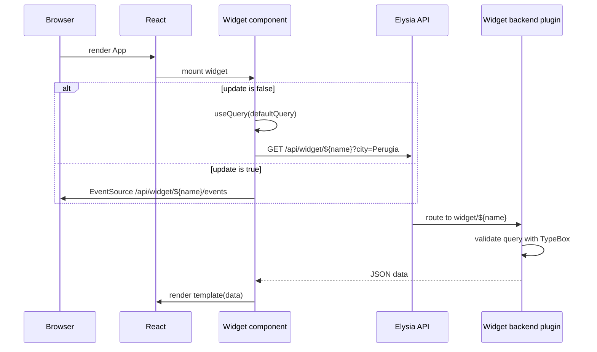

# Runtime Architecture

This page describes the end-to-end runtime of the application: how the Bun HTTP server serves the React frontend, how the Elysia API is mounted, how the frontend is bundled and rendered, and how widgets extend both the backend and the UI.

## Overview

The project is a Bun-first full-stack application. The same runtime starts a production-grade HTTP server, bundles the frontend assets, serves the HTML entry point, and mounts a type-safe Elysia API. Widgets are the primary extension mechanism: each widget can register a backend route and a React component that fetches its own data. A widget can opt into live updates through a Server-Sent Events endpoint.

```mermaid
flowchart TD
    User[Browser] -->|HTTP request| Bun[Bun serve]
    Bun -->|/api/*| Elysia[Elysia API]
    Elysia -->|widget/${name}| WidgetBE[Widget backend plugin]
    Elysia -->|widget/${name}/events| WidgetSSE[Widget SSE stream]
    Bun -->|/*| HTML[index.html]
    HTML --> Bundle[Bun-bundled frontend.tsx]
    Bundle --> React[React client render]
    React --> Widgets[Widget React components]
    Widgets -->|fetch /api/widget/${name}| WidgetBE
    Widgets -->|EventSource /api/widget/${name}/events| WidgetSSE
```

_Server, frontend, and widget request flow including the optional SSE update channel._

## Server entry point

`src/index.ts` is the only server entry point. It creates an Elysia instance for API routes and starts Bun's HTTP server with a route table.

### Elysia API

The `api` object is an `Elysia` instance with a path prefix of `api`:

```ts
export const api = new Elysia({ prefix: 'api' })
  .onError(({ code, error, set }) => {
    console.log(error)
    if (code === 'INTERNAL_SERVER_ERROR') {
      set.status = 502
      return { message: 'Upstream fetch failed :(' }
    }
  })
```

The error handler maps unhandled internal errors to HTTP 502 with a short JSON message. It is the single place where API-wide failures are normalized.

After the API is created, every widget that exposes a `backend` plugin is mounted onto it:

```ts
for (const widget of WIDGETS) {
  if (widget.backend) {
    api.use(widget.backend)
  }
}
export type Api = typeof api
```

This loop is the only wiring between widgets and the API. The exported `Api` type is used by Eden to keep the client and server types in sync.

### Bun serve routes

The server is started with `Bun.serve` and a static route map:

```ts
const server = serve({
  routes: {
    "/*": index,
    "/api/*": api.fetch
  },
})
```

- `/*` serves the bundled `index.html` for every path that does not match a more specific route. This supports client-side routing if the React app adds routes later.
- `/api/*` delegates to `api.fetch`, so every Elysia endpoint lives under `/api`.

Bun's static-file serving handles the favicon, fonts, and compiled assets referenced from `index.html`.

## Frontend entry point and client-side rendering

### HTML entry point

`src/index.html` is a minimal HTML shell:

```html
<!doctype html>
<html>
  <head>
    <meta charset="UTF-8" />
    <meta name="viewport" content="width=device-width, initial-scale=1.0" />
    <link rel="icon" href="./assets/favicon.png" />
    <title>Glance</title>
  </head>
  <body class="page-columns-transitioned" id="root">
    <script type="module" src="./frontend.tsx"></script>
  </body>
</html>
```

The body is the React root. In development Bun serves `frontend.tsx` directly and compiles it on demand. In production `bun build` emits a browser bundle from `./src/index.html` into `dist/`.

### React root and hot reload

`src/frontend.tsx` maps every registered widget to its React element, groups the elements by the widget's declared `size` into `left`, `center`, and `right` arrays, and passes those arrays to `App`. It then creates or reuses a React root and renders the `App` component. The `import.meta.hot.data.root` pattern preserves the React root across Bun module hot reloads:

```ts
const widgets = WIDGETS.map(widget => {
  const Component = widget.Component;
  return {
    widget: <Component key={widget.name} />,
    size: widget.size
  }
});

const widgetsByColumn = widgets.reduce<Record<"left" | "center" | "right", React.ReactElement[]>>(
  (acc, item) => {
    acc[item.size].push(item.widget);
    return acc;
  },
  { left: [], center: [], right: [] }
);

const elem = document.getElementById("root")!;
const app = (
  <StrictMode>
    <App widgets={widgetsByColumn} />
  </StrictMode>
);

(import.meta.hot.data.root ??= createRoot(elem)).render(app);
```

This preserves React state across hot reloads, so updated modules re-render without unmounting the tree. Each widget is rendered with `key={widget.name}`, which keeps React reconciliation stable across the list.

### App layout

`src/App.tsx` renders the page chrome: header with the logo, a three-column main area, and a footer. It wraps the tree in a single `QueryClientProvider` from TanStack Query so widgets can use `useQuery`. Widgets are placed in the column matching their `size`: `left` and `right` widgets render in the narrow side columns, while `center` widgets render in the wide middle column.

## Widget plugin model

Widgets are the main extension point. Each widget is a self-contained unit that can define:

- a `name` used as a route segment and React key;
- a `size` of `left`, `center`, or `right` that decides which column renders it;
- an optional Elysia backend plugin under `/api/widget/${name}`;
- an optional `update: true` flag that also exposes `/api/widget/${name}/events` and makes the frontend consume it via Server-Sent Events;
- a React component that fetches from its own backend.

The widget registry is the plain array exported from `src/lib/widgets/index.ts`:

```ts
import { Meteo } from "./Meteo";
import { Sistema } from "./Sistema";

export const WIDGETS = [Meteo, Sistema]
```

Both the server and the frontend import this same array, so widgets are registered in exactly one place.

### Widget builder

`src/lib/builder.tsx` exports the `Widget` class and a `defineWidget` helper. A widget can be static (no backend) or dynamic (backend + typed query + default query). Dynamic widgets can additionally opt into live updates with `update: true`.

For dynamic widgets, `build()`:

1. Creates an Elysia plugin at `widget/${name}` with a `GET /` route.
2. Validates the incoming query string with a TypeBox schema.
3. If `update` is true, adds a `GET /events` route that returns a `text/event-stream` response and re-evaluates the backend handler every 5000 milliseconds.
4. Returns a React component that either calls `useQuery` to fetch `/api/widget/${name}` or uses `useSseWidget` to listen on `/api/widget/${name}/events`, then renders the provided `template` with the fetched `data`.

The current implementation always uses `defaultQuery` as the active query; there is no runtime UI for changing parameters yet.



_Widget data fetch from mount to backend response, showing both the request/response and SSE paths._

### Example widgets

`src/lib/widgets/Meteo.tsx` and `src/lib/widgets/Sistema.tsx` illustrate the two dynamic patterns currently in use.

**Meteo** is a request/response widget in the `left` column. Its backend geocodes a city with the Open-Meteo geocoding API and then fetches current conditions and a multi-day forecast. The default query targets Perugia:

```ts
export const Meteo = defineWidget<typeof querySchema, WeatherData>({
  name: "meteo",
  size: "left",
  query: querySchema,
  defaultQuery: { city: "Perugia" },
  async backend({ query }) { /* ... */ },
  template: ({ data }) => { /* ... */ },
});
```

**Sistema** is a live-update widget in the `right` column. It reads CPU, memory, load average, and uptime from `/proc` on Linux and streams updates through Server-Sent Events because `update: true` is set:

```ts
export const Sistema = defineWidget({
  name: "sistema",
  size: "right",
  query: querySchema,
  defaultQuery: {},
  update: true,
  async backend() { /* ... */ },
  template: ({ data }) => { /* ... */ },
});
```

## Build and run modes

### Development

```bash
bun dev
```

Runs `bun --hot src/index.ts`. The server starts directly from TypeScript, and Bun's module hot reload applies changes to both server and frontend modules without a full restart.

### Production build

```bash
bun run build
```

Runs `bun build` starting from `src/index.html`, targeting the browser, minifying, and emitting source maps to `dist/`. It also defines `process.env.NODE_ENV` as `"production"` and exposes only environment variables matching `BUN_PUBLIC_*` to the bundle.

### Production serve

```bash
bun start
```

Runs `src/index.ts` with `NODE_ENV=production`. The server still imports `src/index.html`, but in production the bundled assets are served from `dist/`.

### Environment-variable exposure

`bunfig.toml` repeats the public-env filter:

```toml
[serve.static]
env = "BUN_PUBLIC_*"
```

Only environment variables prefixed with `BUN_PUBLIC_` are exposed to the frontend bundle or static serving.

## Configuration and invariants

- **Single source of truth for widgets**: the `WIDGETS` array in `src/lib/widgets/index.ts` is imported by both `src/index.ts` and `src/frontend.tsx`. Adding or removing a widget there changes both the API surface and the rendered UI.
- **Widget column assignment**: each widget declares a `size` of `left`, `center`, or `right`. `frontend.tsx` groups widgets by that value, and `App.tsx` renders each group in the matching column.
- **API prefix is applied twice**: Elysia is constructed with `prefix: 'api'`, and the Bun route table also mounts `api.fetch` under `/api/*`. The result is that widget endpoints are reachable at `/api/widget/${name}`.
- **No server-side rendering**: React is rendered entirely in the browser. `index.html` contains no pre-rendered markup.
- **Query defaults are hard-coded**: dynamic widgets use `defaultQuery` for every mount. To make a widget configurable at runtime, the widget component must be extended to accept and send different query parameters.
- **SSE update interval is fixed**: widgets with `update: true` re-evaluate their backend every 5000 milliseconds and stream the result through an `EventSource`.
- **Type safety across the boundary**: `export type Api = typeof api` lets Eden generate a type-safe client, although the current widgets use plain `fetch` and `EventSource`.

## Failure modes

- An unhandled exception inside the Elysia API is logged to the console and returned to the client as HTTP 502 with `{ message: 'Upstream fetch failed :(' }`. The original error details are not sent to the client.
- If a widget's `fetch` fails or returns a non-OK response, the widget renders `<div className="widget-error">Errore caricamento {name}</div>`.
- While data is loading, the widget renders `<div className="widget-loading">Caricamento {name}...</div>`.
- If a widget has no `backend`, `build()` returns only a `Component`; no route is registered for it.
- If an SSE connection breaks, the hook surfaces an error and the widget renders the same error markup.

## Extension points

- Add a widget by creating a new file under `src/lib/widgets/`, exporting a widget built with `defineWidget`, and adding it to the `WIDGETS` array.
- Change API-wide behavior by editing `src/index.ts`, for example adding global middleware, authentication, or CORS.
- Change the page layout by editing `src/App.tsx`; widgets are passed in grouped by `left`, `center`, and `right`.
- Replace plain `fetch` inside widgets with the Eden client to gain end-to-end type safety using the exported `Api` type.
