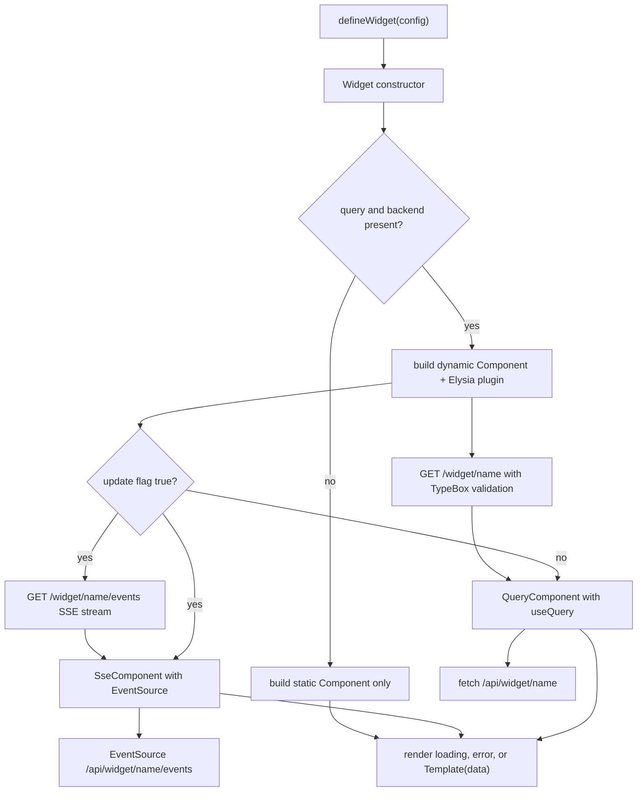
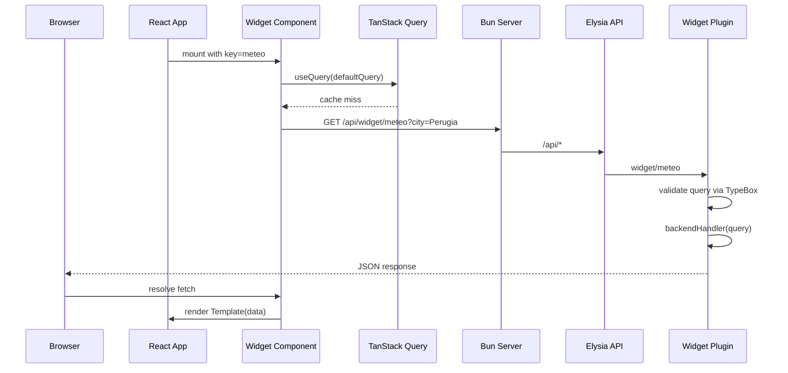
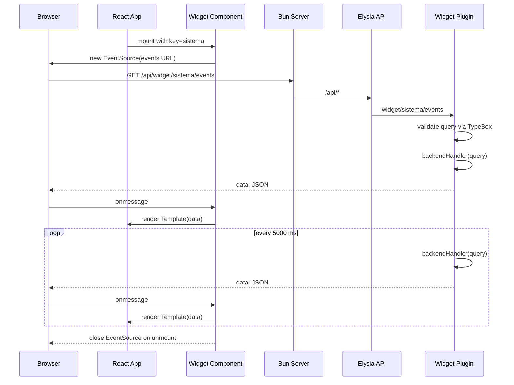

# Widget Framework

The widget framework is the project's primary extension model. A single `defineWidget` call describes everything a widget needs: a unique name, a layout size, an optional TypeBox query schema, an optional backend handler, an optional `update` flag, and a React template. The `Widget` class turns that description into an Elysia backend plugin and either a TanStack Query-driven or a Server-Sent Events-driven React component.

Both the server and the browser import the same widget registry (`src/lib/widgets/index.ts`), so registering a widget in one place mounts its backend route, chooses its data strategy, and renders it in the correct page column.

For the concepts behind static and dynamic widgets, see [Widget Concepts](/openwiki/concepts/widgets.md). For widget-specific details, see the [Meteo widget](/openwiki/concepts/widgets/meteo.md) and [Sistema widget](/openwiki/concepts/widgets/sistema.md) pages.

## Entry points

`src/lib/builder.tsx` exports the public API:

- `defineWidget` — helper that builds a dynamic widget in one call.
- `Widget` — the builder class that supports both dynamic and static configs.
- TypeScript types: `WidgetDefinition`, `DynamicWidgetConfig`, `StaticWidgetConfig`.
- `scheme` — a convenience re-export of the TypeBox builder `t`, so widgets can declare schemas without importing `@sinclair/typebox` or `elysia` directly.

```ts
export const defineWidget = <TQuery extends TObject<TProperties>, TData>(
  config: DynamicWidgetConfig<TQuery, TData>
) => new Widget(config).build();

export const scheme = t;
```

The server consumes the returned `backend` plugin; the frontend consumes the returned `Component` and `size`.

## Widget configuration shapes

`WidgetDefinition` is the result type returned by `build()`:

```ts
export type WidgetDefinition<TQuery extends TObject<TProperties> = any, TData = any> = {
  name: string;
  backend?: AnyElysia;
  Component: React.FC;
  size: "left" | "center" | "right";
};
```

A **dynamic** widget fetches data from its own backend and must declare a `size`:

```ts
export type DynamicWidgetConfig<TQuery extends TObject<TProperties>, TData> = {
  name: string;
  size: "left" | "center" | "right";
  query: TQuery;
  defaultQuery: Static<TQuery>;
  backend: (context: { query: Static<TQuery> }) => TData | Promise<TData>;
  template: (props: { data: Awaited<TData> }) => React.ReactElement;
  update?: boolean;
};
```

A **static** widget only renders markup. The current `StaticWidgetConfig` type does not include a `size` field:

```ts
export type StaticWidgetConfig = {
  name: string;
  template: () => React.ReactElement;
};
```

`name` is used as the React `key` and as the URL segment `/api/widget/${name}`. `size` is used by `src/frontend.tsx` and `src/App.tsx` to place the widget in the left, center, or right page column.

## Build flow

`Widget.build()` inspects the config and branches:



_How a widget definition is turned into a backend route, a TanStack Query-driven component, an SSE-driven component, or a static component._

### Dynamic widget backend

When `query` and `backendHandler` are present, `build()` creates an Elysia plugin:

```ts
const backendPlugin = new Elysia({ prefix: `widget/${name}` })
  .get("/", async ({ query: reqQuery }) => {
    return await backendHandler({ query: reqQuery as Static<TQuery> });
  }, {
    query
  });
```

The plugin is prefixed with `widget/${name}`. Because the root `api` instance is created with `prefix: 'api'` and mounted under `/api/*` in `Bun.serve`, the final endpoint is `GET /api/widget/${name}`. Elysia validates the incoming query string against the TypeBox schema and passes the typed result to `backendHandler`.

Unhandled exceptions inside the Elysia API are normalized at the API level: `src/index.ts` logs the error and returns HTTP 502 with `{ message: 'Upstream fetch failed :(' }`. The widget then renders its own error state because the `fetch` response is not OK.

### Server-Sent Events backend

If `update: true` is set, `build()` adds a second route to the same plugin:

```ts
backendPlugin.get("/events", async ({ query: reqQuery }) => {
  let interval: ReturnType<typeof setInterval> | null = null;
  let closed = false;

  const stream = new ReadableStream({
    async start(controller) {
      const send = async () => {
        if (closed) return;
        try {
          const data = await backendHandler({ query: reqQuery as Static<TQuery> });
          const payload = `data: ${JSON.stringify(data)}\n\n`;
          controller.enqueue(new TextEncoder().encode(payload));
        } catch (err) {
          const payload = `event: error\ndata: ${JSON.stringify({ message: (err as Error).message })}\n\n`;
          controller.enqueue(new TextEncoder().encode(payload));
        }
      };

      await send();
      interval = setInterval(send, SSE_INTERVAL_MS);
    },
    cancel() {
      closed = true;
      if (interval) clearInterval(interval);
    }
  });

  return new Response(stream, {
    headers: {
      "Content-Type": "text/event-stream",
      "Cache-Control": "no-cache",
      "Connection": "keep-alive",
    }
  });
}, { query });
```

The route returns a `ReadableStream` with `Content-Type: text/event-stream`. It invokes the same `backendHandler`, validates the query with TypeBox, sends the first result immediately, then re-sends every 5000 ms. If the handler throws, it emits an SSE `error` event instead of crashing the stream. The stream's `cancel` handler stops the interval when the client disconnects.

### Dynamic widget frontend

For widgets that do **not** set `update: true`, the generated component uses TanStack Query:

```ts
const QueryComponent: React.FC = () => {
  const activeQuery = defaultQuery;
  const searchParams = serializeQueryParams(activeQuery);

  const { isPending, error, data } = useQuery({
    queryKey: [name, activeQuery],
    queryFn: async () => {
      const res = await fetch(`/api/widget/${name}${searchParams}`);
      if (!res.ok) throw new Error("Errore recupero dati");
      return res.json();
    },
  });

  if (isPending) return <div className="widget-loading">Caricamento {name}...</div>;
  if (error || !data) return <div className="widget-error">Errore caricamento {name}</div>;

  return <Template data={data} />;
};
```

The `queryKey` combines the widget name and the active query, so each distinct default query gets its own cache entry. Query parameters are serialized by a shared helper that drops `undefined` and `null` values and converts the rest with `String(value)`.

### SSE-driven widget frontend

For widgets with `update: true`, the generated component uses a custom `useSseWidget` hook instead of `useQuery`:

```ts
function useSseWidget<TData>(url: string) {
  const [data, setData] = useState<TData | null>(null);
  const [error, setError] = useState<Error | null>(null);
  const [isPending, setIsPending] = useState(true);

  useEffect(() => {
    const source = new EventSource(url);

    source.onmessage = (event) => {
      setIsPending(false);
      setError(null);
      setData(JSON.parse(event.data));
    };

    source.onerror = () => {
      setIsPending(false);
      setError(new Error("Connessione SSE interrotta"));
    };

    return () => {
      source.close();
    };
  }, [url]);

  return { isPending, error, data };
}
```

The component opens `EventSource` to `/api/widget/${name}/events${searchParams}`, renders the same loading and error states, and passes each incoming JSON payload to the template. The connection is closed automatically when the component unmounts.

### Static widget fallback

If a config has no `query` or no `backendHandler`, `build()` returns only a `Component` that renders the template with no data. No Elysia route is created for it. Note that the current `StaticWidgetConfig` type does not include `size`; in practice the registry currently contains only dynamic widgets.

## Data-fetch lifecycle

A query-driven widget's request flows from React hydration through the Elysia API and back:



_Typical TanStack Query fetch for the Meteo widget, from mount to successful render._

An update-driven widget replaces the single fetch with a persistent SSE stream:



_SSE stream lifecycle for the Sistema widget, including the repeating backend poll and unmount cleanup._

## Registration and mounting

Widgets are collected in `src/lib/widgets/index.ts`:

```ts
import { Meteo } from "./Meteo";
import { Sistema } from "./Sistema";

export const WIDGETS = [Meteo, Sistema];
```

The server mounts every widget backend onto the `api` instance:

```ts
for (const widget of WIDGETS) {
  if (widget.backend) {
    api.use(widget.backend);
  }
}
```

The frontend maps each widget to a component/size pair and groups them by column:

```ts
const widgets = WIDGETS.map(widget => {
  const Component = widget.Component;
  return {
    widget: <Component key={widget.name} />,
    size: widget.size
  };
});

const widgetsByColumn = widgets.reduce<Record<"left" | "center" | "right", React.ReactElement[]>>(
  (acc, item) => {
    acc[item.size].push(item.widget);
    return acc;
  },
  { left: [], center: [], right: [] }
);
```

`src/App.tsx` then renders `widgets.left` and `widgets.right` in narrow side columns and `widgets.center` in the full-width center column. Because both server and client read the same `WIDGETS` array, adding a widget in one place changes the API surface, the rendered UI, and the layout slot.

## Example widgets

### Meteo — query-driven fetch

`src/lib/widgets/Meteo.tsx` uses the `scheme` export to declare a `city` parameter and fetches weather data from Open-Meteo:

```ts
import { defineWidget, scheme } from "../builder";

const querySchema = scheme.Object({
  city: scheme.String(),
});

export const Meteo = defineWidget<typeof querySchema, WeatherData>({
  name: "meteo",
  size: "left",
  query: querySchema,
  defaultQuery: {
    city: "Perugia",
  },
  async backend({ query }) {
    const geoUrl = `https://geocoding-api.open-meteo.com/v1/search?name=${encodeURIComponent(query.city)}&count=1&language=it&format=json`;
    const geoRes = await fetch(geoUrl);
    if (!geoRes.ok) {
      throw new Error("Errore geocodifica");
    }

    const geo = await geoRes.json() as { results?: Array<{ name: string; latitude: number; longitude: number; timezone: string }> };
    if (!geo.results || geo.results.length === 0) {
      throw new Error("Città non trovata");
    }

    const place = geo.results[0]!;

    const forecastUrl =
      `https://api.open-meteo.com/v1/forecast?` +
      `latitude=${place.latitude}` +
      `&longitude=${place.longitude}` +
      `&current=temperature_2m,relative_humidity_2m,is_day,precipitation,weather_code,wind_speed_10m` +
      `&daily=weather_code,temperature_2m_max,temperature_2m_min` +
      `&timezone=auto&forecast_days=4&language=it`;

    const forecastRes = await fetch(forecastUrl);
    if (!forecastRes.ok) {
      throw new Error("Errore previsioni");
    }

    const forecast = await forecastRes.json() as { /* ... */ };

    return {
      current: { /* ... */ },
      forecast: [/* ... */],
    };
  },
  template: ({ data }) => {
    return (
      <article className="widget">
        <div className="widget-content">
          <h2 className="size-h2 color-highlight">{data.current.city}</h2>
          {/* ... */}
        </div>
      </article>
    );
  },
});
```

### Sistema — query-driven SSE

`src/lib/widgets/Sistema.tsx` reads `/proc/stat`, `/proc/meminfo`, `/proc/loadavg`, and `/proc/uptime` and streams the result through Server-Sent Events:

```ts
import { defineWidget, scheme } from "../builder";

const querySchema = scheme.Object({});

export const Sistema = defineWidget({
  name: "sistema",
  size: "right",
  query: querySchema,
  defaultQuery: {},
  update: true,
  async backend() {
    const [cpuUsage, memory, load, uptime] = await Promise.all([
      getCpuUsage(),
      getMemoryUsage(),
      getLoadAverage(),
      getUptime(),
    ]);

    return { cpuUsage, memory, load, uptime };
  },
  template: ({ data }) => {
    return (
      <article className="widget">
        <div className="widget-content">
          <h2 className="size-h2 color-highlight margin-bottom-10">Sistema</h2>
          {/* ... */}
        </div>
      </article>
    );
  },
});
```

Because `update` is `true`, the builder mounts `GET /api/widget/sistema/events` and the frontend opens an `EventSource` instead of calling `useQuery`.

## Loading, error, and empty states

The generated component has fixed UI branches:

- **Loading**: `<div className="widget-loading">Caricamento {name}...</div>` is shown while `useQuery` is pending or before the first SSE message arrives.
- **Error or missing data**: `<div className="widget-error">Errore caricamento {name}</div>` is shown when `error` is truthy or `data` is missing.
- **Success**: the provided `template` receives `data` and renders normally.

Static widgets skip these branches and render their `template` directly, because they have no data to wait for.

## Invariants and limitations

- **Single source of truth**: the `WIDGETS` array is imported by both `src/index.ts` and `src/frontend.tsx`.
- **Layout placement**: every dynamic widget must declare `size` as `left`, `center`, or `right`. `src/frontend.tsx` groups widgets by size and `src/App.tsx` renders them in the matching column.
- **Hard-coded query values**: the generated component always uses `defaultQuery`. There is currently no mechanism for runtime user input or prop-driven query changes.
- **Plain `fetch` and `EventSource`**: the builder uses manual `fetch` and `EventSource` even though `@elysia/eden` and `@ap0nia/eden-react-query` are available in `package.json`.
- **URL shape**: query parameters are serialized with `URLSearchParams`, skipping `undefined` and `null` values. All non-skipped values are converted with `String(value)`.
- **API prefix**: widget endpoints are reachable at `/api/widget/${name}` because the Elysia `api` instance uses `prefix: 'api'` and `Bun.serve` mounts `api.fetch` under `/api/*`. SSE endpoints are at `/api/widget/${name}/events`.
- **Static widgets currently lack `size`**: `StaticWidgetConfig` does not include a `size` field, so a purely static widget would not receive layout placement from the registry.

## Extension points

- **Add a widget**: create a file under `src/lib/widgets/`, export a widget built with `defineWidget`, and add it to `WIDGETS`.
- **Change layout**: set `size` to `left`, `center`, or `right` to move the widget between the side columns and the main column.
- **Enable live updates**: set `update: true` to switch a widget from a TanStack Query fetch to a Server-Sent Events stream.
- **Make widgets configurable**: replace the hard-coded `activeQuery = defaultQuery` with React state or props, then pass the new query to both the fetch URL and the SSE URL.
- **Use Eden for type safety**: replace the manual `fetch` with an Eden client generated from `export type Api = typeof api`.
- **Static-only widgets**: omit `query` and `backend` from the config to render markup without a backend route. To support layout placement for static widgets, add `size` to `StaticWidgetConfig` and the constructor.
