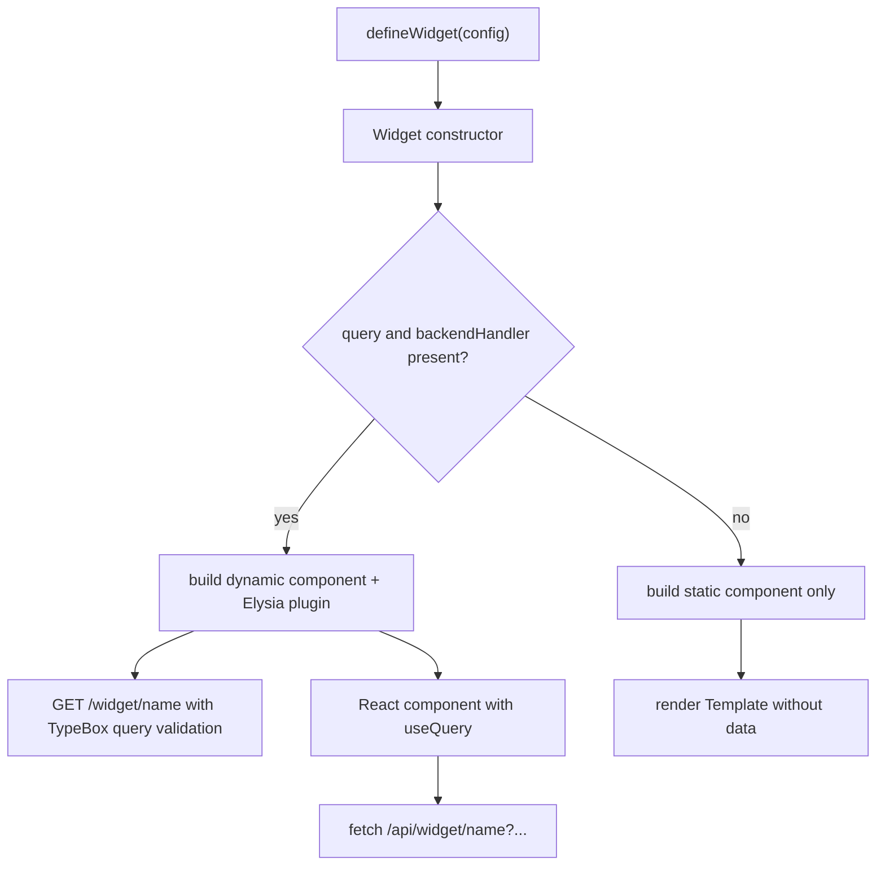
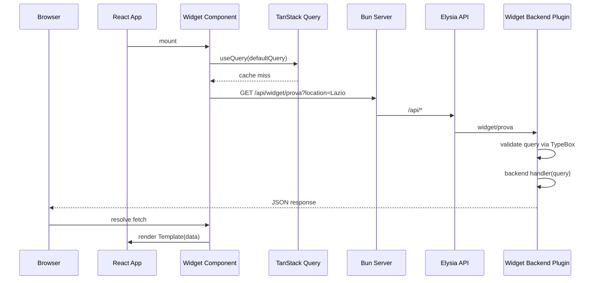

# Widget Framework

The widget framework is the project's primary extension model. A single `defineWidget` call describes everything a widget needs: a unique name, an optional TypeBox query schema, an optional backend handler, and a React template. The `Widget` class turns that description into an Elysia backend plugin and a TanStack Query-driven React component.

Both the server and the browser import the same widget registry (`src/lib/widgets/index.ts`), so registering a widget in one place mounts its backend route and renders its UI.

## Entry points

The public API is the `defineWidget` helper:

```ts
export const defineWidget = <TQuery extends TObject<TProperties>, TData>(
  config: DynamicWidgetConfig<TQuery, TData>
) => new Widget(config).build();
```

`src/lib/builder.tsx` exports `defineWidget`, the `Widget` class, and the TypeScript types that describe widget shapes. The server consumes the returned `backend` plugin; the frontend consumes the returned `Component`.

## Widget configuration shapes

`WidgetDefinition` is the result type returned by `build()`:

```ts
export type WidgetDefinition<TQuery extends TObject<TProperties> = any, TData = any> = {
  name: string;
  backend?: AnyElysia;
  Component: React.FC;
};
```

There are two input shapes. A **dynamic** widget fetches data from its own backend:

```ts
export type DynamicWidgetConfig<TQuery extends TObject<TProperties>, TData> = {
  name: string;
  query: TQuery;
  defaultQuery: Static<TQuery>;
  backend: (context: { query: Static<TQuery> }) => TData | Promise<TData>;
  template: (props: { data: Awaited<TData> }) => React.ReactElement;
};
```

A **static** widget only renders markup:

```ts
export type StaticWidgetConfig = {
  name: string;
  template: () => React.ReactElement;
};
```

`name` is used both as the React `key` and as the URL segment `/api/widget/${name}`.

## Build flow

`Widget.build()` inspects the config and branches:



_How a widget definition is turned into a backend route, a data-fetching component, or a static component._

### Dynamic widget backend

When `query` and `backendHandler` are present, `build()` creates an Elysia plugin:

```ts
const backendPlugin = new Elysia({ prefix: `widget/${name}` })
  .get("/", async ({ query: reqQuery }) => {
    return await backendHandler({ query: reqQuery as Static<TQuery> });
  }, {
    query
  });
```

The plugin is prefixed with `widget/${name}`. Because the root `api` instance is created with `prefix: 'api'` and mounted under `/api/*` in `Bun.serve`, the final endpoint is `GET /api/widget/${name}`. Elysia validates the incoming query string against the TypeBox schema and passes the typed result to `backendHandler`.

### Dynamic widget frontend

The generated React component is a `React.FC` with no props. It calls `useQuery` with the widget's `defaultQuery`, builds a URL from the query values, fetches the endpoint, and renders either a loading state, an error state, or the template:

```ts
const Component: React.FC = () => {
  const activeQuery = defaultQuery;

  const { isPending, error, data } = useQuery({
    queryKey: [name, activeQuery],
    queryFn: async () => {
      let searchParams = "";
      if (activeQuery) {
        const params = new URLSearchParams();
        Object.entries(activeQuery).forEach(([key, value]) => {
          if (value !== undefined && value !== null) {
            params.append(key, String(value));
          }
        });
        const queryString = params.toString();
        if (queryString) searchParams = `?${queryString}`;
      }

      const res = await fetch(`/api/widget/${name}${searchParams}`);
      if (!res.ok) throw new Error("Errore recupero dati");
      return res.json();
    },
  });

  if (isPending) return <div className="widget-loading">Caricamento {name}...</div>;
  if (error || !data) return <div className="widget-error">Errore caricamento {name}</div>;

  return <Template data={data} />;
};
```

The `queryKey` combines the widget name and the active query, so each distinct default query gets its own cache entry.

### Static widget fallback

If a config has no `query` or no `backendHandler`, `build()` returns only a `Component` that renders the template with no data. No Elysia route is created for it.

## Data-fetch lifecycle

A dynamic widget's data request flows from React hydration through the Elysia API and back:



_Dynamic widget data fetch from component mount to backend response._

## Registration and mounting

Widgets are collected in `src/lib/widgets/index.ts`:

```ts
import { Prova } from "./Prova";

export const WIDGETS = [Prova];
```

The server mounts every widget backend onto the `api` instance:

```ts
for (const widget of WIDGETS) {
  if (widget.backend) {
    api.use(widget.backend);
  }
}
```

The frontend renders every widget component:

```ts
const widgets = WIDGETS.map(widget => {
  const Component = widget.Component;
  return <Component key={widget.name} />;
});
```

Because both sides read the same array, adding a widget in one place changes both the API surface and the rendered UI.

## Example widget

`src/lib/widgets/Prova.tsx` shows the intended pattern:

```ts
export const Prova = defineWidget({
  name: "prova",
  query: t.Object({
    location: t.String(),
  }),
  backend({ query }) {
    return {
      message: query.location
    };
  },
  template: ({ data }) => {
    return (
      <main>Ciaoo sono dentro prova: {data.message}</main>
    );
  },
  defaultQuery: {
    location: "Lazio"
  }
});
```

It declares a required `location` string, echoes it from the backend, and renders it in the template.

## Loading, error, and empty states

The generated component has fixed UI branches:

- **Loading**: `<div className="widget-loading">Caricamento {name}...</div>` is shown while `useQuery` is pending.
- **Error or missing data**: `<div className="widget-error">Errore caricamento {name}</div>` is shown when `error` is truthy or `data` is missing.
- **Success**: the provided `template` receives `data` and renders normally.

Unhandled exceptions inside the Elysia API are normalized at the API level: `src/index.ts` logs the error and returns HTTP 502 with `{ message: 'Upstream fetch failed :(' }`. The widget then renders its own error state because the `fetch` response is not OK.

## Invariants and limitations

- **Single source of truth**: the `WIDGETS` array is imported by both `src/index.ts` and `src/frontend.tsx`.
- **Hard-coded query values**: the generated component always uses `defaultQuery`. There is currently no mechanism for runtime user input or prop-driven query changes.
- **Plain `fetch`**: the builder uses a manual `fetch` call even though `@elysia/eden` and `@ap0nia/eden-react-query` are available in `package.json`.
- **URL shape**: query parameters are serialized with `URLSearchParams`, skipping `undefined` and `null` values. All non-skipped values are converted with `String(value)`.
- **API prefix**: widget endpoints are reachable at `/api/widget/${name}` because the Elysia `api` instance uses `prefix: 'api'` and `Bun.serve` mounts `api.fetch` under `/api/*`.

## Extension points

- **Add a widget**: create a file under `src/lib/widgets/`, export a widget built with `defineWidget`, and add it to `WIDGETS`.
- **Make widgets configurable**: replace the hard-coded `activeQuery = defaultQuery` with React state or props, then pass the new query to `useQuery` and `queryFn`.
- **Use Eden for type safety**: replace the manual `fetch` with an Eden client generated from `export type Api = typeof api`.
- **Static-only widgets**: omit `query` and `backend` from the config to render markup without a backend route.
