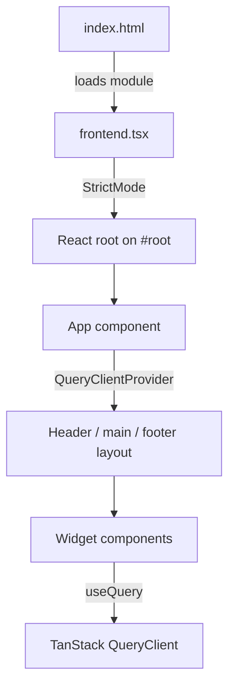

# Frontend Concepts

The frontend is a client-side React 19 application bundled and served by Bun. It is intentionally minimal: a single HTML shell, one React root, a top-level `QueryClientProvider`, and a small set of CSS design tokens. Widgets provide the dynamic content; the frontend layer is responsible for mounting them, sharing the query client, and keeping the layout responsive.

## Rendering flow



_How the browser loads the React app and mounts the widget tree._

## HTML entry point

`src/index.html` is a minimal shell. The `<body>` element is both the React root container and the only visible markup delivered by the server:

```html
<!doctype html>
<html>
  <head>
    <meta charset="UTF-8" />
    <meta name="viewport" content="width=device-width, initial-scale=1.0" />
    <link rel="icon" href="./assets/favicon.png" />
    <title>Glance</title>
  </head>
  <body class="page-columns-transitioned" id="root">
    <script type="module" src="./frontend.tsx"></script>
  </body>
</html>
```

Bun resolves `./frontend.tsx` and bundles it on demand in development or as part of the production build. There is no server-side rendering: the markup delivered to the browser is exactly what appears in `index.html`.

## React root and hot reload

`src/frontend.tsx` is the browser entry point. It creates or reuses a React root, renders `App` inside `StrictMode`, and preserves the root object across Bun module hot reloads:

```tsx
const elem = document.getElementById("root")!;
const app = (
  <StrictMode>
    <App widgets={widgets} />
  </StrictMode>
);

(import.meta.hot.data.root ??= createRoot(elem)).render(app);
```

The `import.meta.hot.data.root` pattern stores the root in Bun's HMR data bag. When a module is replaced, the existing root is reused so React state and DOM are preserved and only the changed subtree re-renders. `StrictMode` is always active, so components are intentionally double-rendered and effects are re-run in development to surface side-effect bugs.

The `widgets` array is produced from the shared widget registry:

```tsx
const widgets = WIDGETS.map(widget => {
  const Component = widget.Component;
  return <Component key={widget.name} />;
});
```

Each widget's `name` is used as the React `key`, so the registry is also the source of truth for the rendered order.

## App layout

`src/App.tsx` owns the page chrome and the TanStack Query client. It imports `index.css`, imports the SVG logo, creates a single `QueryClient`, and wraps the tree in `QueryClientProvider`:

```tsx
const queryClient = new QueryClient()

export const App: React.FC<{ widgets: Array<React.ReactElement> }> = ({ widgets }) => {
  return (
    <QueryClientProvider client={queryClient}>
      <div className="flex flex-column body-content">
        <header className="header-container content-bounds">
          <div className="header flex padding-inline-widget widget-content-frame">
            <div className="logo" aria-hidden="true">
              <Logo />
            </div>
          </div>
        </header>
        <div className="content-bounds grow">
          <main className="page content-ready" id="page" aria-live="polite" aria-busy="false">
            <div className="page-content" id="page-content">
              <div className="page-columns">
                <div className="page-column page-column-small">
                  {widgets.map((widget) => widget)}
                </div>
                <div className="page-column page-column-full"></div>
                <div className="page-column page-column-small"></div>
              </div>
            </div>
          </main>
        </div>
        <footer className="footer flex items-center flex-column">
          <div>
            <a className="size-h3" href="https://github.com/RobertoFretel" target="_blank" rel="noreferrer">RobertoFretel</a>
          </div>
        </footer>
      </div>
    </QueryClientProvider>
  );
}
```

The layout is a full-height flex column: header, scrollable main area, and footer. Inside `main`, three columns are rendered. Widgets are placed in the first small column. The center column is currently empty and the third small column is empty. `main` has accessibility hints (`aria-live="polite"`, `aria-busy="false"`) for announcing dynamic content changes.

## TanStack Query setup

A single `QueryClient` is instantiated in `App.tsx` and shared through `QueryClientProvider`. Widgets consume it via `useQuery` inside the generated components from `src/lib/builder.tsx`. The project depends on `@tanstack/react-query` and also includes `@ap0nia/eden-react-query` and `@elysia/eden`, but the current widget builder uses a plain `fetch` inside `queryFn` rather than Eden integration.

The query key for each widget is `[name, activeQuery]`, which keeps widget caches isolated and keyed by the active query object.

## CSS conventions

`src/index.css` is a single global stylesheet that defines the entire visual system. It is imported directly by `App.tsx` and bundled by Bun.

### Design tokens

The stylesheet uses CSS custom properties for colors, spacing, typography, and radii:

- Color system is built on a base hue/saturation/lightness triad (`--bgh`, `--bgs`, `--bgl`) and a scheme-aware multiplier (`--scheme`).
- The default palette is dark; `light` mode is activated by setting `data-scheme="light"` on `:root`.
- Spacing tokens include `--widget-gap`, `--widget-content-padding`, `--content-bounds-padding`, and `--border-radius`.
- Type scale is expressed in rems against a base `:root` font size of `10px`.

### Font

The application font is JetBrains Mono, loaded as a local WOFF2 file with `font-display: swap`:

```css
@font-face {
  font-family: 'JetBrains Mono';
  font-style: normal;
  font-weight: 400;
  font-display: swap;
  src: url('./assets/JetBrainsMono-Regular.woff2') format('woff2');
}
```

The body applies the font with ligatures disabled and a 1.6 line height.

### Layout primitives

A small utility vocabulary is used throughout `App.tsx` and widget markup:

- `.flex`, `.flex-column` for flex direction.
- `.grow` for `flex-grow: 1`.
- `.content-bounds` for centered, padded containers.
- `.page-column-small` is fixed at `300px` on desktop; `.page-column-full` fills remaining space.
- `.widget-content-frame` provides the bordered card look used for widgets and the header.

### Responsive behavior

Breakpoints are written as plain `@media` blocks at the bottom of the stylesheet:

- `max-width: 1190px` hides the desktop header and switches the small column to a tabbed mobile view.
- `max-width: 1190px` and `display-mode: standalone` adjusts safe-area insets for installed PWA use.
- `max-width: 550px` reduces the root font size and widget spacing.

The mobile navigation pattern uses `:has()` to show one column at a time based on checked radio inputs, but the corresponding radio controls are not currently rendered by `App.tsx`.

## Build and environment wiring

`tsconfig.json` enables React's automatic JSX runtime (`"jsx": "react-jsx"`) and bundler module resolution (`"moduleResolution": "bundler"`), so `frontend.tsx` can import TypeScript/TSX extensions directly. The path alias `@/*` maps to `./src/*` but the current frontend files use relative imports.

`package.json` exposes `bun dev` for development with hot reload, `bun run build` for a minified browser bundle into `dist/`, and `bun start` for production. The build defines `process.env.NODE_ENV` as `"production"` and only inlines environment variables prefixed with `BUN_PUBLIC_*`.

## Invariants and limitations

- **Client-side only**: React mounts on `document.getElementById("root")`. No markup is pre-rendered on the server.
- **Single query client**: one `QueryClient` instance is created in `App.tsx` and shared by all widgets.
- **Shared widget registry**: the `WIDGETS` array from `src/lib/widgets/index.ts` determines both backend routes and the rendered order on the frontend.
- **HMR root preservation**: the root is stored on `import.meta.hot.data` so hot reloads do not unmount the React tree.
- **No runtime routing**: `App.tsx` renders a fixed layout; React Router or similar is not installed.
- **Empty center/right columns**: the layout reserves space for them, but only the first small column currently renders widgets.
