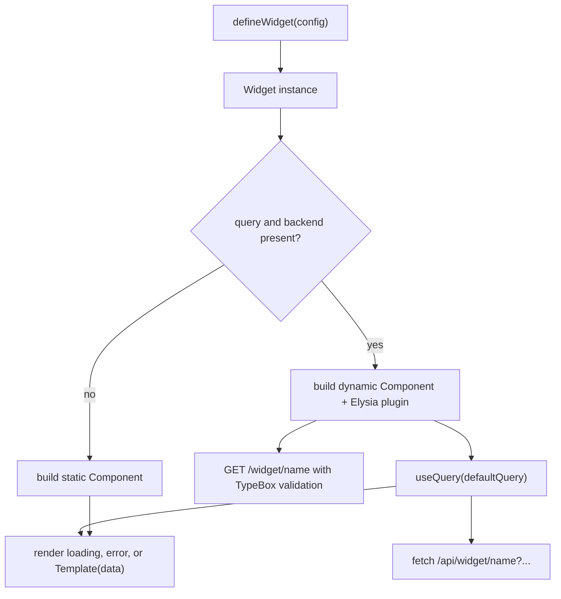
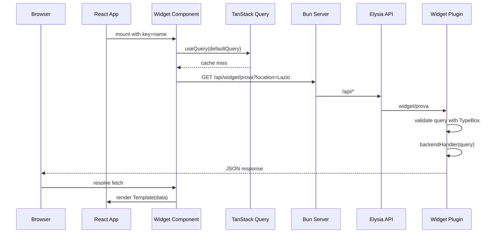

# Widget Concepts

A widget is a self-contained unit of UI that may also own a small data contract. In this project, every widget is described by a single definition object and then registered in `src/lib/widgets/index.ts`. The same definition drives both the server-side API route and the client-side React component, so adding a widget in one place makes it available everywhere.

For the lower-level builder mechanics, see [Widget Framework](/openwiki/architecture/widget-framework.md).

## Static versus dynamic widgets

Widgets come in two shapes.

A **static widget** only renders markup. Its config contains a `name` and a `template` function, and `build()` returns a plain `Component` with no backend route.

A **dynamic widget** additionally declares a TypeBox query schema, a `defaultQuery`, a `backend` handler, and a `template` that receives fetched data. `build()` turns it into:

- an Elysia plugin that answers `GET /api/widget/{name}`
- a React component that fetches that endpoint through TanStack Query

```ts
export type StaticWidgetConfig = {
  name: string;
  template: () => React.ReactElement;
};

export type DynamicWidgetConfig<TQuery extends TObject<TProperties>, TData> = {
  name: string;
  query: TQuery;
  defaultQuery: Static<TQuery>;
  backend: (context: { query: Static<TQuery> }) => TData | Promise<TData>;
  template: (props: { data: Awaited<TData> }) => React.ReactElement;
};
```

The same `name` is reused as the React `key`, the Elysia route segment, and the base of the `useQuery` cache key.

## Widget lifecycle

From author intent to pixels on screen, a widget passes through definition, registration, build, mount, and (for dynamic widgets) data fetch.



_How a widget definition becomes either a static component or a dynamic component plus backend route._

The `build()` step is the central branching point. If the config lacks `query` or `backendHandler`, the result has only a `Component`. Otherwise it also has a `backend` plugin.

## Registration

All widgets are collected into one array:

```ts
import { Prova } from "./Prova";

export const WIDGETS = [Prova];
```

This array is the single source of truth. The server imports it to mount each widget backend onto the `api` instance, and the frontend imports it to render each widget component.

<!-- openwiki: mermaid parse failed and this diagram was converted to a text fence so it does not break rendering. Fix the diagram source and restore the mermaid fence. Parser error: Heuristic: a semicolon inside a label breaks rendering; rephrase the label. -->
```text
flowchart LR
    subgraph Registration
        Registry["src/lib/widgets/index.ts exports WIDGETS"]
    end
    subgraph Server
        ServerMount["src/index.ts loops over WIDGETS and api.use(widget.backend)"]
    end
    subgraph Browser
        ClientRender["src/frontend.tsx maps WIDGETS to &lt;Component key=widget.name /&gt;"]
        AppMount["App.tsx renders widgets into page-column-small"]
    end
    Registry --> ServerMount
    Registry --> ClientRender
    ClientRender --> AppMount
```

_Both server and client derive their widget surface from the same registry array._

The frontend renders each widget with `key={widget.name}`, which keeps React reconciliation stable across the list.

## Query serialization

A dynamic widget always starts from its `defaultQuery`. The builder serializes that object into URL search parameters before calling `fetch`:

```ts
const params = new URLSearchParams();
Object.entries(activeQuery).forEach(([key, value]) => {
  if (value !== undefined && value !== null) {
    params.append(key, String(value));
  }
});
```

Key rules:

- `undefined` and `null` values are dropped entirely.
- Remaining values are converted with `String(value)`.
- The resulting string is appended as `?key=value&...` to `/api/widget/{name}`.

Elysia validates the incoming query against the TypeBox schema before the backend handler runs. If validation fails, the request never reaches the handler.

## Loading and error conventions

The generated dynamic component has three hard-coded UI branches:

1. **Loading** — while `useQuery` is pending, it renders `<div className="widget-loading">Caricamento {name}...</div>`.
2. **Error or missing data** — when `error` is truthy or `data` is absent, it renders `<div className="widget-error">Errore caricamento {name}</div>`.
3. **Success** — the provided `template` receives `{ data }` and renders normally.

Static widgets skip all three branches and render their `template` directly, because they have no data to wait for.

## Runtime data lifecycle

Putting the pieces together, a dynamic widget's first render looks like this:



_Dynamic widget request flow from mount to successful render._

The `queryKey` passed to `useQuery` is `[name, activeQuery]`, so each distinct default query gets its own cache entry.

## Example widget

`src/lib/widgets/Prova.tsx` illustrates the dynamic pattern:

```ts
export const Prova = defineWidget({
  name: "prova",
  query: t.Object({
    location: t.String(),
  }),
  backend({ query }) {
    return { message: query.location };
  },
  template: ({ data }) => {
    return <main>Ciaoo sono dentro prova: {data.message}</main>;
  },
  defaultQuery: {
    location: "Lazio",
  },
});
```

It declares a required `location` parameter, echoes it from the backend, and renders the result.

## Invariants and extension points

- **Single registry**: both server and client import the same `WIDGETS` array from `src/lib/widgets/index.ts`. Adding or removing a widget there changes both the API and the UI.
- **No runtime query changes**: the generated component always uses `defaultQuery`. User input or prop-driven queries would require replacing the hard-coded `activeQuery` with React state.
- **Backend route exists only for dynamic widgets**: omitting `query` and `backend` produces a static widget with no server route.
- **Class hooks for styling**: the loading and error states expose `widget-loading` and `widget-error` class names for CSS customization.
- **Left-column mounting**: `App.tsx` currently renders widgets inside the `page-column-small` column on the left.
