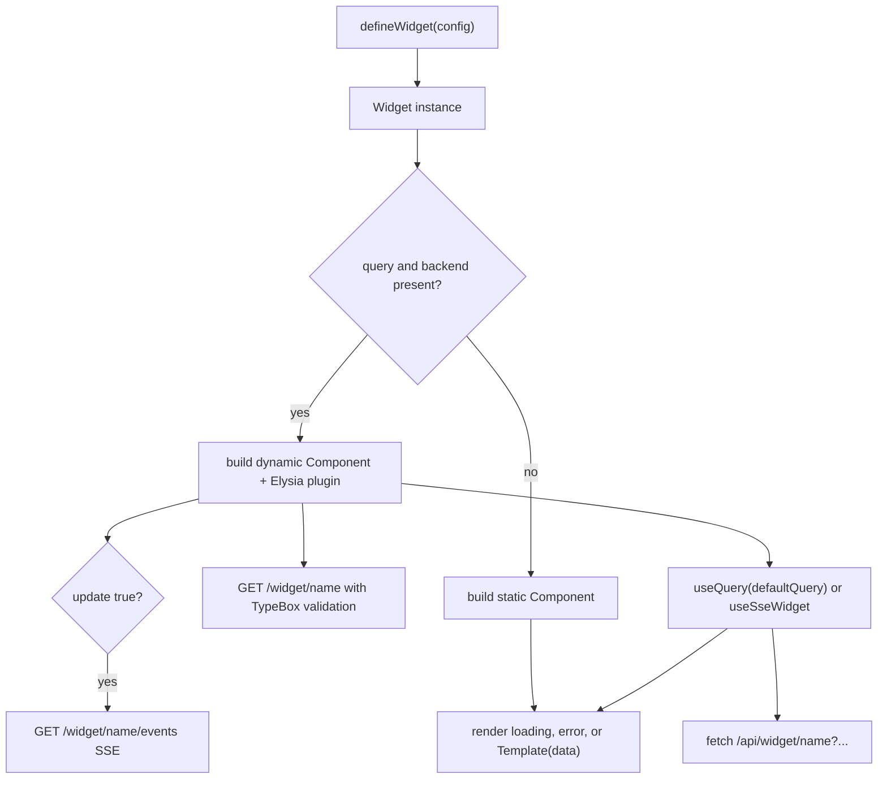
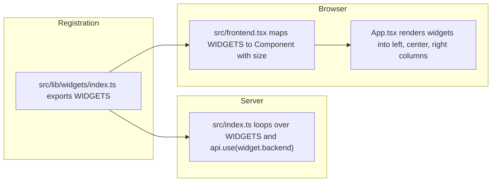
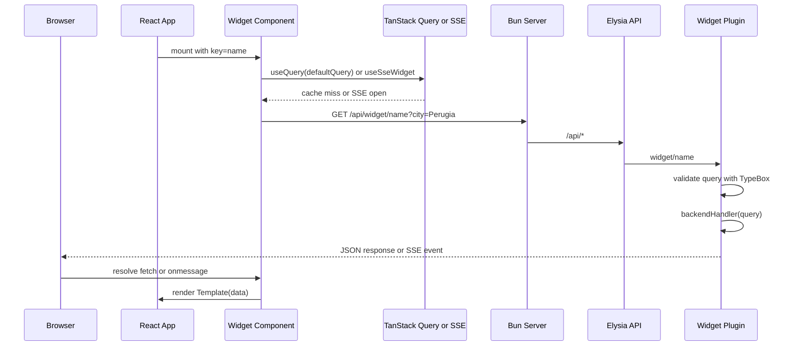

# Widget Concepts

A widget is a self-contained unit of UI that may also own a small data contract. In this project, every widget is described by a single definition object and then registered in `src/lib/widgets/index.ts`. The same definition drives both the server-side API route and the client-side React component, so adding a widget in one place makes it available everywhere.

For the lower-level builder mechanics, see [Widget Framework](/openwiki/architecture/widget-framework.md).

## Widget shape

Widgets are described by the `WidgetDefinition` type produced by `Widget.build()`:

```ts
export type WidgetDefinition<TQuery extends TObject<TProperties> = any, TData = any> = {
  name: string;
  backend?: AnyElysia;
  Component: React.FC;
  size: "left" | "center" | "right";
};
```

The builder supports two input shapes.

A **static widget** only renders markup. Its config contains a `name` and a `template` function, and `build()` returns a plain `Component` with no backend route. The current static type does not include `size`, although `WidgetDefinition` requires it.

A **dynamic widget** declares a TypeBox query schema, a `defaultQuery`, a `backend` handler, a `template` that receives fetched data, a `size` for layout, and an optional `update` flag. `build()` turns it into:

- an Elysia plugin that answers `GET /api/widget/{name}`
- a React component that fetches that endpoint
- an optional `GET /api/widget/{name}/events` SSE endpoint when `update: true`

```ts
export type DynamicWidgetConfig<TQuery extends TObject<TProperties>, TData> = {
  name: string;
  size: "left" | "center" | "right";
  query: TQuery;
  defaultQuery: Static<TQuery>;
  backend: (context: { query: Static<TQuery> }) => TData | Promise<TData>;
  template: (props: { data: Awaited<TData> }) => React.ReactElement;
  update?: boolean;
};
```

In practice, every widget is created through `defineWidget`, which only accepts a dynamic config.

The same `name` is reused as the React `key`, the Elysia route segment, and the base of the cache key for TanStack Query.

## Widget lifecycle

From author intent to pixels on screen, a widget passes through definition, registration, build, mount, and (for dynamic widgets) data fetch.



_How a widget definition becomes either a static component or a dynamic component plus backend route._

The `build()` step is the central branching point. If the config lacks `query` or `backend`, the result has only a `Component`. Otherwise it also has a `backend` plugin, and the rendered component is either a TanStack Query component or an SSE component depending on the `update` flag.

## Registration

All widgets are collected into one array:

```ts
import { Meteo } from "./Meteo";
import { Sistema } from "./Sistema";

export const WIDGETS = [Meteo, Sistema];
```

This array is the single source of truth. The server imports it to mount each widget backend onto the `api` instance, and the frontend imports it to render each widget component into the correct layout column.



_Both server and client derive their widget surface from the same registry array._

The frontend renders each widget with `key={widget.name}`, which keeps React reconciliation stable across the list.

## Column layout

`frontend.tsx` groups built widgets by their `size` field and passes three arrays to `App.tsx`:

```ts
const widgetsByColumn = widgets.reduce<Record<"left" | "center" | "right", React.ReactElement[]>>(
  (acc, item) => {
    acc[item.size].push(item.widget);
    return acc;
  },
  { left: [], center: [], right: [] }
);
```

`App.tsx` renders those arrays into three page columns:

- `left` widgets go in the first `page-column page-column-small`
- `center` widgets go in `page-column page-column-full`
- `right` widgets go in the last `page-column page-column-small`

The current registry places `Meteo` on the left and `Sistema` on the right.

## Query serialization

A dynamic widget starts from its `defaultQuery`. The builder serializes that object into URL search parameters before calling `fetch`:

```ts
const params = new URLSearchParams();
Object.entries(query).forEach(([key, value]) => {
  if (value !== undefined && value !== null) {
    params.append(key, String(value));
  }
});
const queryString = params.toString();
return queryString ? `?${queryString}` : "";
```

Key rules:

- `undefined` and `null` values are dropped entirely.
- Remaining values are converted with `String(value)`.
- The resulting string is appended as `?key=value&...` to `/api/widget/{name}`.

Elysia validates the incoming query against the TypeBox schema before the backend handler runs. If validation fails, the request never reaches the handler.

## Data fetching modes

Dynamic widgets can fetch data in two ways.

### TanStack Query mode (default)

When `update` is falsy or omitted, the generated component calls `useQuery` with a `queryKey` of `[name, activeQuery]` and fetches `/api/widget/{name}` with the serialized default query. This is the behavior used by `Meteo`.

### Server-Sent Events mode

When `update: true`, the generated component uses `useSseWidget` instead of `useQuery`. The builder adds a second route, `GET /widget/{name}/events`, which returns a `text/event-stream` response. The server immediately sends the current data and then re-runs the backend handler every five seconds, pushing the result to the client. This is the behavior used by `Sistema`. The interval is controlled by `SSE_INTERVAL_MS` in `src/lib/builder.tsx`.

Both modes share the same loading and error UI.

## Loading and error conventions

The generated dynamic component has three hard-coded UI branches:

1. **Loading** — while data is pending, it renders `<div className="widget-loading">Caricamento {name}...</div>`.
2. **Error or missing data** — when `error` is truthy or `data` is absent, it renders `<div className="widget-error">Errore caricamento {name}</div>`.
3. **Success** — the provided `template` receives `{ data }` and renders normally.

Static widgets skip all three branches and render their `template` directly, because they have no data to wait for.

## Runtime data lifecycle

Putting the pieces together, a dynamic widget's first render looks like this:



_Dynamic widget request flow from mount to successful render._

For SSE widgets, the same `backendHandler` is reused on the server-side stream loop, and the connection is closed when the component unmounts.

## Example widgets

`src/lib/widgets/Meteo.tsx` illustrates the query polling pattern:

```ts
export const Meteo = defineWidget<typeof querySchema, WeatherData>({
  name: "meteo",
  size: "left",
  query: querySchema,
  defaultQuery: { city: "Perugia" },
  async backend({ query }) {
    // fetch geocoding and forecast, return WeatherData
  },
  template: ({ data }) => {
    // render current weather and forecast
  },
});
```

`src/lib/widgets/Sistema.tsx` illustrates the SSE pattern:

```ts
export const Sistema = defineWidget({
  name: "sistema",
  size: "right",
  query: querySchema,
  defaultQuery: {},
  update: true,
  async backend() {
    // read /proc/stat, /proc/meminfo, /proc/loadavg, /proc/uptime
    return { cpuUsage, memory, load, uptime };
  },
  template: ({ data }) => {
    // render system metrics
  },
});
```

## Invariants and extension points

- **Single registry**: both server and client import the same `WIDGETS` array from `src/lib/widgets/index.ts`. Adding or removing a widget there changes both the API and the UI.
- **No runtime query changes**: the generated component always uses `defaultQuery`. User input or prop-driven queries would require replacing the hard-coded `activeQuery` with React state.
- **Backend route exists only for dynamic widgets**: omitting `query` and `backend` produces a static widget with no server route.
- **SSE for live data**: setting `update: true` switches the component to Server-Sent Events and adds a `/events` route. The five-second interval is global and defined in the builder.
- **Class hooks for styling**: the loading and error states expose `widget-loading` and `widget-error` class names for CSS customization.
- **Three-column mounting**: `App.tsx` renders widgets into `left`, `center`, and `right` columns based on the widget's `size` field.
