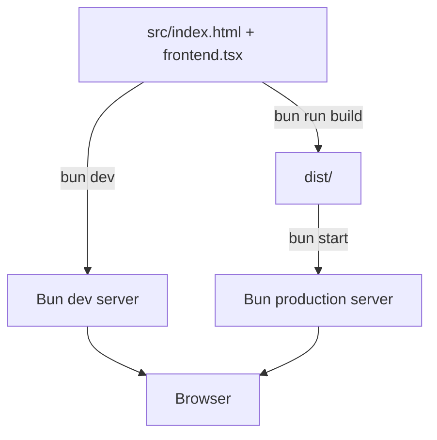

# Build & Deployment

This page covers how the application is developed, bundled, and served. Everything is handled by Bun: the development server with hot module reload, the production build from the HTML entry point, and the production HTTP server.

## Scripts overview

The three lifecycle scripts are defined in `package.json`:

| Script | Command | Purpose |
|--------|---------|---------|
| `dev` | `bun --hot src/index.ts` | Start the development server with hot reload. |
| `build` | `bun build ./src/index.html --outdir=dist --sourcemap --target=browser --minify --define:process.env.NODE_ENV='"production"' --env='BUN_PUBLIC_*'` | Bundle the frontend for the browser into `dist/`. |
| `start` | `NODE_ENV=production bun src/index.ts` | Run the production server. |

These scripts are the only build and deployment entry points. There are no Dockerfiles, container manifests, or platform-specific deploy configs in the repository.



_Development and production server flows._

## Development server

`bun dev` runs the same `src/index.ts` entry point used in production, but with Bun's `--hot` flag. Hot reload applies to server modules and, indirectly, to the frontend bundle that Bun compiles on demand from `src/index.html`.

The browser entry point `src/frontend.tsx` preserves the React root across hot updates:

```ts
(import.meta.hot.data.root ??= createRoot(elem)).render(app);
```

This keeps React state and the DOM intact while changed modules are swapped in.

During development, `bunfig.toml` controls which environment variables are visible to static files:

```toml
[serve.static]
env = "BUN_PUBLIC_*"
```

Only variables whose names start with `BUN_PUBLIC_` are exposed to the frontend. Secrets without that prefix are not leaked to the browser.

## Production build

`bun run build` runs `bun build` starting from `src/index.html`. The important flags are:

- `--target=browser` — emit a browser bundle.
- `--outdir=dist` — write assets to `dist/`.
- `--minify` — minify the output.
- `--sourcemap` — emit source maps.
- `--define:process.env.NODE_ENV='"production"'` — force `process.env.NODE_ENV` to the string `"production"` inside the bundle.
- `--env='BUN_PUBLIC_*'` — inline only environment variables that match `BUN_PUBLIC_*`.

The HTML shell imports `frontend.tsx`, which Bun follows transitively, so the build produces a complete set of static assets. `tsconfig.json` excludes `dist` from TypeScript compilation so generated bundles do not participate in type checking.

## Production server

`bun start` runs `src/index.ts` with `NODE_ENV=production`. The server entry point imports `src/index.html` and starts `Bun.serve` with a route table that serves the HTML shell for all non-API paths and delegates `/api/*` to the Elysia API. In production, Bun resolves the script references in `index.html` to the assets emitted in `dist/`.

Because the same entry point is used in both modes, API route registration, widget mounting, and error handling stay identical between development and production.

## Environment variables

The project follows Bun's public-environment convention:

- Prefix any value that the frontend needs with `BUN_PUBLIC_`.
- The build flag `--env='BUN_PUBLIC_*'` inlines matching variables into the browser bundle.
- `bunfig.toml` applies the same filter to static files served during development.
- `process.env.NODE_ENV` is overwritten to `"production"` in the bundle by `--define`, regardless of the ambient value on the build machine.

No source file currently reads `process.env` or `import.meta.env`, so the `BUN_PUBLIC_*` filter is a forward-looking guard rather than a runtime requirement. If you add client-side configuration later, it must use the `BUN_PUBLIC_` prefix or it will be omitted from the bundle.

## Operational invariants and failure modes

- **Build before starting in production.** `bun start` assumes `dist/` exists; if it is missing, the server may serve an unbundled or broken frontend. The normal production flow is `bun run build && bun start`.
- **Single server entry point.** `src/index.ts` is used by both `dev` and `start`; changes there affect both environments.
- **No server-side rendering.** The server delivers `index.html` as-is and React mounts in the browser. The production build only changes how the assets are bundled, not how the page is served.
- **Secrets must not use the `BUN_PUBLIC_` prefix.** Any variable with that prefix is eligible to be embedded in the client bundle or served to the browser.
- **`dist/` is excluded from TypeScript.** This prevents build artifacts from causing type-check errors, but it also means `dist/` is not validated by `tsc`.
- **Hot reload is a dev-only feature.** The `--hot` flag is not present in the `start` script, and the `import.meta.hot.data` fallback is only meaningful during development.

## Extension points

- Adjust the build output by editing the `build` script in `package.json`, for example changing `--outdir`, adding `--splitting`, or removing `--minify` for debugging.
- Add client-side environment variables by exporting variables with a `BUN_PUBLIC_` prefix before running `bun dev` or `bun run build`.
- Change the production host behavior by editing `src/index.ts` — for example adding TLS, a custom port, or proxy headers.
- Add a deployment wrapper (Dockerfile, systemd unit, etc.) around the existing scripts without changing the build and serve commands.
