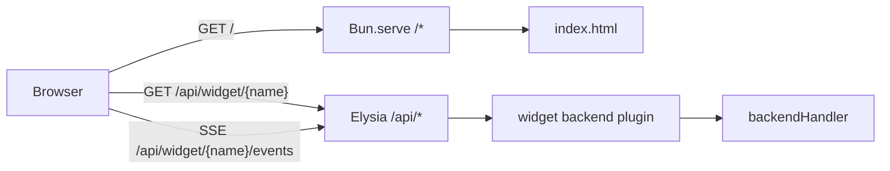

# Quickstart & Local Development

Bun runs the server, bundles the React frontend, and handles hot reload in development. This page gets the app running locally and points to deeper docs for each part of the stack.

## Prerequisites

- [Bun](https://bun.sh) must be installed. The project was created with `bun init` and uses Bun as its only runtime.
- No separate Node.js or additional build tool is required.

## Install dependencies

From the repository root, run:

```bash
bun install
```

This installs Elysia, React, React DOM, TanStack Query, Eden Query, TypeBox, and the corresponding type packages.

## Start the development server

```bash
bun dev
```

This runs `bun --hot src/index.ts`, which starts the Bun HTTP server with hot module reload. The server entry point is `src/index.ts`. The `--hot` flag applies changes to both server and frontend modules without a full restart.

When the server starts, it prints a URL like `http://localhost:3000/`. Open that URL in a browser to see the app.

## Build for production

```bash
bun run build
```

This runs `bun build ./src/index.html --outdir=dist --sourcemap --target=browser --minify --define:process.env.NODE_ENV='"production"' --env='BUN_PUBLIC_*'`. It bundles the frontend into `dist/`, emits source maps, minifies the assets, and inlines only environment variables prefixed with `BUN_PUBLIC_*`.

## Start in production mode

```bash
bun start
```

This runs `NODE_ENV=production bun src/index.ts`. The same `src/index.ts` entry point is used as in development, but without hot reload and with `NODE_ENV` set to `production`. The normal production flow is `bun run build && bun start`.

## Environment variables

Only environment variables starting with `BUN_PUBLIC_` are exposed to the browser bundle. The same filter is configured in `bunfig.toml` for static files served during development:

```toml
[serve.static]
env = "BUN_PUBLIC_*"
```

Keep secrets out of the `BUN_PUBLIC_*` namespace. If you add no client-side environment variables, the filter has no visible effect.

## Project structure at a glance

| Path | Purpose |
|------|---------|
| `src/index.ts` | Server entry point: Elysia `api` router, widget backend mounting, `Bun.serve`. |
| `src/index.html` | Minimal HTML shell; the React root container is `<body id="root">`. |
| `src/frontend.tsx` | Browser entry point: React root creation, `StrictMode`, widget column mapping. |
| `src/App.tsx` | Page chrome: header, three-column layout, footer, and `QueryClientProvider`. |
| `src/lib/builder.tsx` | Widget builder: `Widget` class, `defineWidget`, static/dynamic/SSE factories. |
| `src/lib/widgets/index.ts` | Widget registry. The single source of truth for both server and client. |
| `src/lib/widgets/Meteo.tsx` | One-shot dynamic weather widget example. |
| `src/lib/widgets/Sistema.tsx` | SSE dynamic system-monitor widget example. |
| `package.json` | `dev`, `build`, and `start` scripts, plus dependencies. |
| `tsconfig.json` | React JSX automatic runtime, bundler module resolution, path alias `@/*`. |

## Widget registry and layout

Widgets are registered in one place:

```ts
// src/lib/widgets/index.ts
import { Meteo } from "./Meteo";
import { Sistema } from "./Sistema";

export const WIDGETS = [Meteo, Sistema]
```

Both `src/index.ts` and `src/frontend.tsx` import this array. The server mounts every widget that declares a `backend`; the browser renders every widget into one of three page columns based on `widget.size`:

```tsx
// src/frontend.tsx
const widgetsByColumn = widgets.reduce<Record<"left" | "center" | "right", React.ReactElement[]>>(
  (acc, item) => {
    acc[item.size].push(item.widget);
    return acc;
  },
  { left: [], center: [], right: [] }
);
```

`App.tsx` places `left` and `right` widgets in the small side columns and `center` widgets in the full-width middle column.

A dynamic widget declares a TypeBox query schema, a backend handler, and a template. By default the frontend fetches `/api/widget/{name}` via TanStack Query. If `update: true`, the widget also exposes `/api/widget/{name}/events` and the frontend subscribes via Server-Sent Events instead of polling.

## Request flow



_Widget endpoints are mounted under `/api/*` by `Bun.serve`. SSE endpoints are only registered for widgets with `update: true`._

## Where to find more documentation

The OpenWiki pages are organized by topic:

- [Runtime Architecture](/openwiki/architecture/runtime.md) — how Bun.serve, the Elysia API, frontend bundling, React hydration, and widget backends fit together end-to-end.
- [Widget Framework](/openwiki/architecture/widget-framework.md) — how `defineWidget` turns a TypeBox schema, Elysia backend, and React template into a reusable widget.
- [Widget Concepts](/openwiki/concepts/widgets.md) — static vs dynamic widgets, lifecycle, query serialization, loading/error UI conventions.
- [Frontend Concepts](/openwiki/concepts/frontend.md) — React 19 setup, TanStack Query, Bun HMR root preservation, `App.tsx` layout, and CSS design tokens.
- [Build & Deployment](/openwiki/operations/build-and-deploy.md) — the `bun dev/build/start` scripts, `BUN_PUBLIC_*` variables, and production invariants.
- [Adding a Widget](/openwiki/workflows/add-widget.md) — step-by-step workflow for creating and verifying a new widget.

## Local development tips

- Use `bun dev` for normal development. Hot reload preserves the React root across module updates via `import.meta.hot.data.root`, so UI state is not lost on every file change.
- If you add or remove widgets, update only `src/lib/widgets/index.ts`. Both the server and the browser import the same registry.
- To add a new widget, create a file under `src/lib/widgets/`, export the widget, and import it into `src/lib/widgets/index.ts`.
- The example widgets show the intended patterns:
  - [`src/lib/widgets/Meteo.tsx`](repo://src/lib/widgets/Meteo.tsx) — one-shot dynamic widget that fetches weather data.
  - [`src/lib/widgets/Sistema.tsx`](repo://src/lib/widgets/Sistema.tsx) — dynamic widget with `update: true` that streams system stats over SSE.
- If a widget is not visible after registration, check that it is in the `WIDGETS` array and that the server was restarted or hot-reloaded.
- Backend endpoints for dynamic widgets live at `/api/widget/{name}`; SSE-enabled widgets also expose `/api/widget/{name}/events`.
