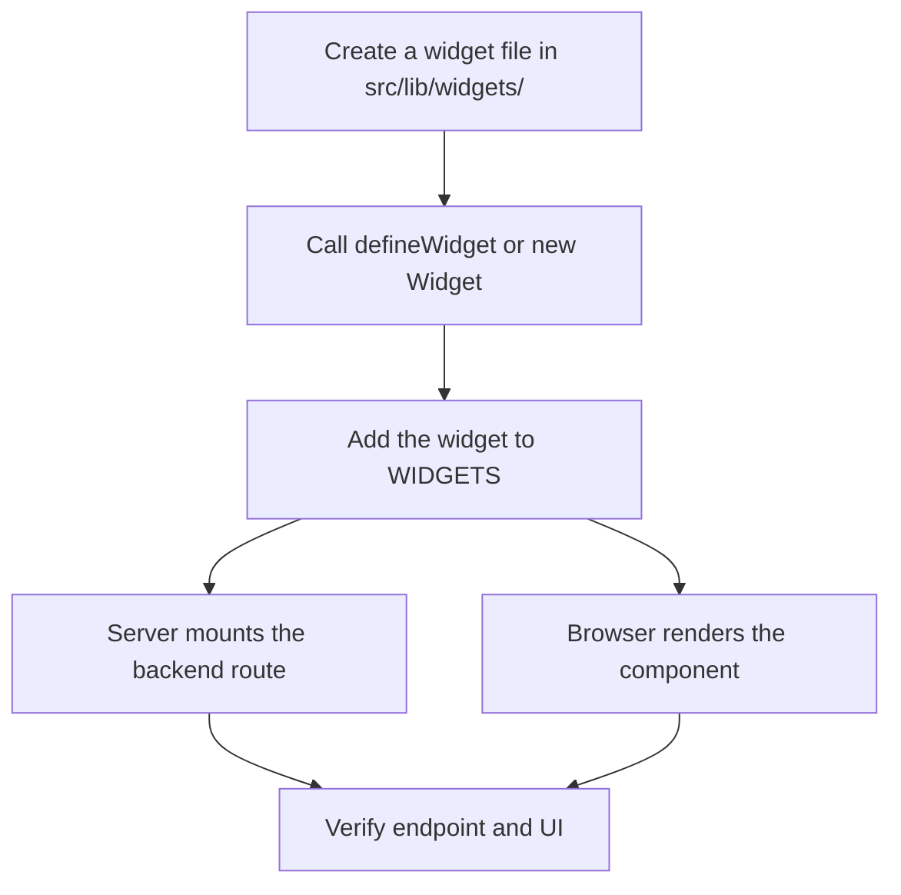

# Adding a Widget

A widget in this project is a self-contained unit of UI that may also own a small backend data contract. This workflow explains how to add one.

For the underlying machinery, see [Widget Framework](/openwiki/architecture/widget-framework.md) and [Widget Concepts](/openwiki/concepts/widgets.md).

## 1. Decide whether the widget is static or dynamic

- **Static widget** — renders markup only, never fetches data.
- **Dynamic widget** — declares a TypeBox query schema, a backend handler, and a data-driven template. It can also stream live updates from the backend by setting `update: true`.



_High-level steps to add a widget._

## 2. Create the widget file

Create a new file under `src/lib/widgets/`, for example `src/lib/widgets/Meteo.tsx`.

### Dynamic widget

```tsx
import { t } from "elysia";
import { defineWidget } from "../builder";

export const Meteo = defineWidget({
  name: "meteo",
  size: "left",
  query: t.Object({
    city: t.String(),
  }),
  defaultQuery: {
    city: "Roma",
  },
  backend({ query }) {
    return {
      forecast: `Sunny in ${query.city}`,
    };
  },
  template({ data }) {
    return (
      <article className="widget">
        <h2>Meteo</h2>
        <p>{data.forecast}</p>
      </article>
    );
  },
});
```

Key fields:

- `name` — used as the React `key`, the Elysia route segment, and the base of the cache key.
- `size` — the column where the widget is rendered: `"left"`, `"center"`, or `"right"`.
- `query` — a TypeBox schema describing the allowed query string.
- `defaultQuery` — the initial query. The generated component always starts here; it does not react to props or state.
- `backend` — the handler that produces the widget data. It receives `{ query }` and may return a value or a `Promise`.
- `template` — React component that receives `{ data }` and renders the widget UI.
- `update` — optional boolean that switches the frontend from a TanStack Query fetch to a Server-Sent Events stream. Defaults to `false`.

### Dynamic widget with live updates

Set `update: true` to make the generated component open an `EventSource` to `/api/widget/{name}/events` instead of calling `/api/widget/{name}` through TanStack Query. The backend pushes a new message every five seconds and closes the stream automatically when the component unmounts.

```tsx
import { t } from "elysia";
import { defineWidget } from "../builder";

export const Sistema = defineWidget({
  name: "sistema",
  size: "right",
  query: t.Object({}),
  defaultQuery: {},
  update: true,
  async backend() {
    return {
      cpuUsage: 12,
      memory: { usedPercent: 45, usedGB: 7.2, totalGB: 16 },
      load: { average: 0.4, cores: 8, percent: 5 },
      uptime: "3h 12m",
    };
  },
  template({ data }) {
    return (
      <article className="widget">
        <h2>Sistema</h2>
        <p>CPU: {data.cpuUsage}%</p>
      </article>
    );
  },
});
```

### Static widget

Static widgets do not fetch data, so they do not go through `defineWidget` (which requires a dynamic config). Use the `Widget` class directly:

```tsx
import { Widget } from "../builder";

export const Clock = new Widget({
  name: "clock",
  size: "left",
  template: () => <div className="widget">Current time widget</div>,
}).build();
```

A static widget has no backend route and renders its template immediately. Although the static type only lists `name` and `template`, the frontend reads `widget.size` to assign widgets to columns, so `size` must be supplied at runtime.

## 3. Register the widget

Export the new widget from `src/lib/widgets/index.ts`:

```ts
import { Meteo } from "./Meteo";
import { Sistema } from "./Sistema";
import { Clock } from "./Clock";

export const WIDGETS = [Meteo, Sistema, Clock];
```

This array is the single source of truth. The server uses it to mount backend routes, and the frontend uses it to render components grouped by column. You do **not** need to edit `src/index.ts` or `src/frontend.tsx`.

## 4. Run the development server

```bash
bun dev
```

`bun dev` runs `src/index.ts` with Bun's hot-reload flag. New widgets and route mounting are picked up automatically.

## 5. Verify end-to-end

### Verify the backend endpoint

Dynamic widgets expose `GET /api/widget/{name}`. Widgets with `update: true` also expose `GET /api/widget/{name}/events`:

```bash
curl "http://localhost:3000/api/widget/meteo?city=Roma"
# Expected: {"forecast":"Sunny in Roma"}
```

For SSE widgets you can test the event stream with curl:

```bash
curl -N "http://localhost:3000/api/widget/sistema/events"
# Expected: data: {...}\n\n every 5 seconds
```

The exact port is printed by `Bun.serve` when the server starts. The route exists because the widget's backend plugin, prefixed with `widget/{name}`, is mounted on the root `api` router.

### Verify the frontend

Open the server URL in a browser. The browser entry point maps each widget definition to a React element, groups the elements by `size` into left, center, and right columns, and passes that record to `App`. Inspect the matching column for your widget.

The generated component renders in three states:

1. **Loading** — a `<div className="widget-loading">` while the query is pending or the SSE connection is opening.
2. **Error** — a `<div className="widget-error">` if the fetch fails, the response is not OK, the SSE connection errors, or data is missing.
3. **Success** — the custom `template` receives `{ data }`.

If the widget is missing from the page, the most likely cause is forgetting to add it to `WIDGETS` in `src/lib/widgets/index.ts` or forgetting to set its `size`.

## Invariants and things to remember

- **Name collisions**: the `name` becomes both the React key and the URL segment. Two widgets with the same name will conflict.
- **No runtime query changes**: the generated component always uses `defaultQuery`. Prop-driven or user-driven queries require replacing the hard-coded `activeQuery` with React state.
- **TypeBox validation**: Elysia validates incoming query strings against the declared schema before the `backend` handler runs.
- **Static widgets have no route**: omitting `query` and `backend` creates a static component only.
- **Static widgets still need `size`**: the frontend groups widgets by `size`, so a missing size will crash column assignment even though the type does not require it.
- **Backend errors surface as UI errors**: any non-OK response from `/api/widget/{name}` or an SSE error from `/api/widget/{name}/events` triggers the widget's error markup.
- **SSE widgets keep the connection open**: the `EventSource` is closed only when the component unmounts; the backend clears its interval in the stream's `cancel` handler.
